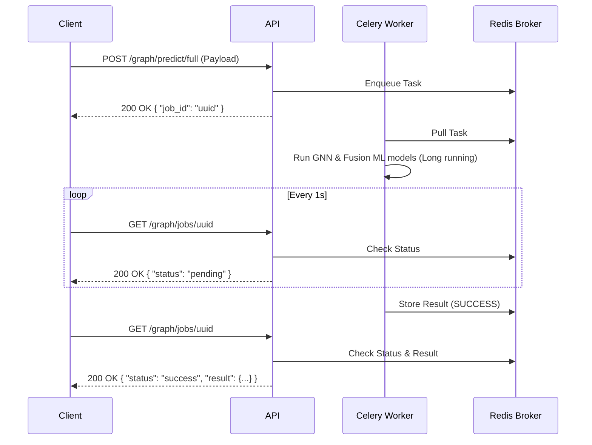

# API Reference

This document outlines the REST and WebSocket endpoints for interacting with the Multimodal Predictive Maintenance Platform.

## Core Endpoints

### `POST /graph/predict`
Accepts a heterogeneous graph state (machines, sensors, conveyors) and returns fault probabilities along with GNN explanations for the top contributing neighbors.

### `POST /graph/predict/full`
End-to-End smoke test pipeline. Sends data through the Two-Tower fusion model, feeds it into the GraphSAGE model for topological context, and outputs a final calibrated anomaly score.
**Note:** This endpoint has been updated to run asynchronously via Celery to prevent API blocking.

**Response:**
```json
{
  "job_id": "uuid-string"
}
```

### `GET /graph/jobs/{job_id}`
Check the status of an async prediction job.

**Response (Pending):**
```json
{
  "job_id": "uuid-string",
  "status": "pending",
  "result": null
}
```

**Response (Success):**
```json
{
  "job_id": "uuid-string",
  "status": "success",
  "result": {
    "machine_id": "M1",
    "timestamp": 1234567890.1,
    "anomaly_score": 0.85,
    "is_anomaly": true,
    "threshold": 0.5,
    "cache_hit": false
  }
}
```

#### Async Polling Pattern Sequence Diagram



## Agent Endpoints (Day 20)

### `POST /agent/session/new`
Creates a new conversation session, returning a unique `session_id`.
**Response:**
```json
{
  "session_id": "uuid-string",
  "message": "Session created."
}
```

### `POST /agent/session/{session_id}/end`
Terminates an active session and clears the conversation history from Redis.

### `WebSocket /agent/chat/{session_id}`
Real-time conversational endpoint for interacting with the diagnostic agent.

#### Protocol
1. **Client** sends plain text message: `"Check machine_001"`
2. **Server** sends acknowledgment:
   ```json
   {"type": "status", "content": "Thinking..."}
   ```
3. **Server** streams agent thought process (Trace Steps):
   ```json
   {"type": "trace_step", "content": {"iteration": "1"}}
   {"type": "trace_step", "content": {"action": "query_sensor_db", "action_args": "{'machine_id': 'machine_001'}"}}
   {"type": "trace_step", "content": {"observation": {"status": "success", "recent_readings": [...]}}}
   ```
4. **Server** sends final answer:
   ```json
   {"type": "final_answer", "content": "The machine looks fine, no alerts found."}
   ```

## Rate Limiting & Security (Day 32)

All endpoints are protected by `slowapi` rate limits using a Redis sliding window.

- **Inference & Agent Routes:** Limited to `100 requests per minute`.
- **Metadata & Informational Routes (e.g. `/health`):** Limited to `1000 requests per minute`.

When a rate limit is exceeded, the server returns a `429 Too Many Requests` status code with the following JSON body and a `Retry-After` header indicating the wait time in seconds:
```json
{
  "error": "Rate limit exceeded: 100 per 1 minute"
}
```

## Audit Logs (Day 32)

### `GET /audit/logs`
Retrieves a structured audit log of all ReAct agent tool calls and alerts dispatched by the system, ensuring compliance tracking.

**Query Parameters:**
- `machine_id` (string, optional): Filter by a specific machine.
- `severity` (string, optional): Filter by alert severity (e.g., `critical`).
- `date` (string YYYY-MM-DD, optional): Filter logs for a specific day.
- `limit` (int, default=100, max=1000): Pagination limit.

**Response:**
```json
[
  {
    "id": "uuid-string",
    "timestamp": "2026-07-23T12:00:00+00:00",
    "actor": "ReActAgent",
    "action": "dispatch_alert",
    "machine_id": "M-1",
    "severity": "critical",
    "inputs": {"machine_id": "M-1", "severity": "critical", "message": "..."},
    "outputs": {"status": "success"},
    "outcome": "success"
  }
]
```
