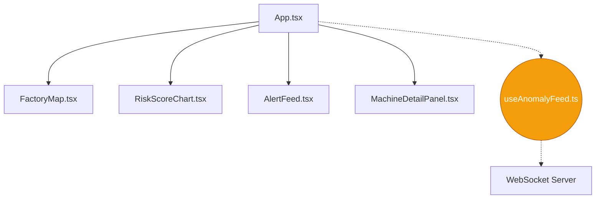

# Frontend Dashboard Setup & Architecture

The frontend is a React 18 application scaffolded with Vite, styled with TailwindCSS, and optimized for real-time visualization of edge inference streams via WebSockets.

## Setup Instructions

Ensure you have Node.js 18+ installed.

1. Navigate to the frontend directory:
   ```bash
   cd frontend
   ```

2. Install dependencies:
   ```bash
   npm install
   ```

3. Run the development server:
   ```bash
   npm run dev
   ```
   The dashboard will be available at `http://localhost:5173`.

## Testing

We use Vitest and React Testing Library for smoke testing the React components.

```bash
npm run test
```

## Component Architecture



### Component Details
- **App**: Layout shell containing the navigation header and responsive grid layout. Maintains the `selectedMachineId` state.
- **FactoryMap**: An interactive SVG visualization. Nodes pulse red when a machine enters a critical anomaly state (score > 0.8).
- **RiskScoreChart**: A 24-hour rolling time-series graph using `recharts`, visualizing the anomaly score trend for the selected machine.
- **AlertFeed**: A scrolling list of incoming alerts, categorized by severity badges.
- **MachineDetailPanel**: A focused view on a specific machine, displaying simulated live telemetry and GradCAM overlays.
- **useAnomalyFeed**: A robust WebSocket hook utilizing `react-use-websocket` with automatic reconnection logic. It manages the global state of the machine scores and alerts.
