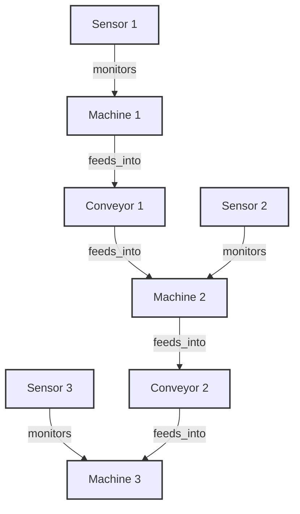

# Equipment Graph Architecture

This document describes the heterogeneous graph schema representing the factory floor's equipment topology.

## Node Types

- **`machine`**: Represents manufacturing machines. Features are `[N, 256]` dimensional vectors obtained by fusing week 1 sensor and visual tower embeddings.
- **`conveyor`**: Represents conveyor belts connecting machines. Currently assigned `[N, 256]` dummy features (all zeros).
- **`sensor`**: Represents monitoring sensors connected to machines. Currently assigned `[N, 256]` dummy features (all zeros).

## Edge Types

1. **`feeds_into`**: Machine $\rightarrow$ Conveyor (Forward flow of materials)
2. **`feeds_into` (Reverse)**: Conveyor $\rightarrow$ Machine (Continuing forward flow of materials)
3. **`monitors`**: Sensor $\rightarrow$ Machine (Observational dependency)

## Schema Diagram

## PyTorch Geometric Integration

The NetworkX topology is converted into a `HeteroData` object where each node type maintains its independent feature matrix and edge types are represented as independent edge index tensors.
