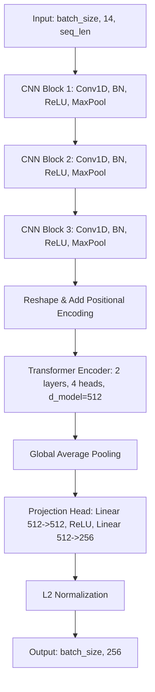

# Models Architecture Documentation

## Sensor Tower

The Sensor Tower is designed to process multivariate time-series sensor data (e.g., CMAPSS sequences) and project them into a shared 256-dimensional embedding space.

### Architecture Overview
1. **1D CNN Feature Extractor**: 3 convolution blocks with `BatchNorm1d`, `ReLU`, and `MaxPool1d`. Outputs a 512-dimensional sequence.
2. **Transformer Encoder**: 2 layers with 4 heads on top of the CNN output, using positional encoding to capture temporal context.
3. **Projection Head**: A 2-layer MLP mapping the Transformer output to a 256-dimensional embedding space with L2 normalization, serving as a shared space for fusion later.

### Layer Diagram

### Parameter Count
- **CNN Extractor**: ~270K parameters
- **Transformer Encoder**: ~3.1M parameters
- **Projection Head**: ~390K parameters
- **Total**: ~3.8M parameters

### Hyperparameter Table
| Hyperparameter | Value | Description |
|---|---|---|
| `in_channels` | 14 | Number of sensor channels |
| `cnn_out_channels` | 512 | Output channels of the final CNN block |
| `d_model` | 512 | Hidden dimension of the Transformer Encoder |
| `nhead` | 4 | Number of attention heads in Transformer |
| `num_layers` | 2 | Number of Transformer Encoder layers |
| `embedding_dim` | 256 | Dimension of the final projected embedding |
