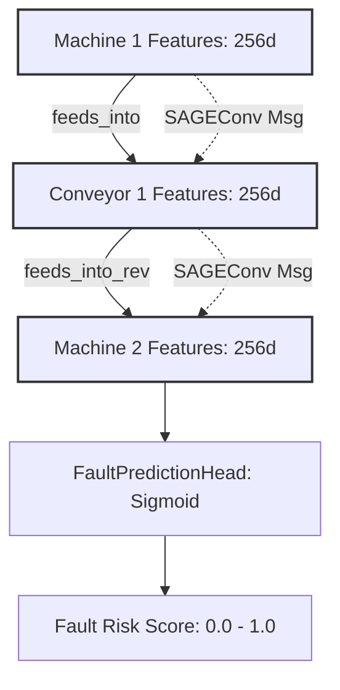

# Models Architecture Documentation

## Sensor Tower

The Sensor Tower is designed to process multivariate time-series sensor data (e.g., CMAPSS sequences) and project them into a shared 256-dimensional embedding space.

### Architecture Overview
1. **1D CNN Feature Extractor**: 3 convolution blocks with `BatchNorm1d`, `ReLU`, and `MaxPool1d`. Outputs a 512-dimensional sequence.
2. **Transformer Encoder**: 2 layers with 4 heads on top of the CNN output, using positional encoding to capture temporal context.
3. **Projection Head**: A 2-layer MLP mapping the Transformer output to a 256-dimensional embedding space with L2 normalization, serving as a shared space for fusion later.

## Heterogeneous GraphSAGE (Equipment Topology GNN)

The HeteroEquipmentGNN is designed to model the physical topology of the factory floor, propagating fault signals and identifying risks across interconnected machines, conveyors, and sensors.

### Architecture Overview
1. **Heterogeneous GNN Wrapper**: Utilizes PyTorch Geometric's `HeteroConv` to handle multiple node types (`machine`, `conveyor`, `sensor`) and edge types independently.
2. **GraphSAGE Layers**: A 2-layer stack of `SAGEConv` (with mean aggregation) per edge relation, allowing for message passing between distinct equipment types.
3. **Fault Prediction Head**: A node-level binary classification head (Linear -> Sigmoid) applied to the target node representations (e.g., `machine`) to output fault probability within the next N cycles.

### Message Passing Diagram

### Fault Propagation & Hop Distance

We simulate faults starting at root machines and traversing downstream via BFS. The `GNNFaultTrainer` uses weighted BCE to handle imbalanced fault classes. As expected, prediction accuracy varies based on hop distance from the root fault.

| Hop Distance | Expected Accuracy | Description |
|---|---|---|
| Hop 0 (Root) | > 95% | Direct fault injection location; clear signal. |
| Hop 1 | ~ 85% | Immediate downstream machine; strong message passing signal. |
| Hop 2 | ~ 70% | Secondary downstream machine; diluted signal. |
| Hop 3+ | < 60% | Distant machines; minimal signal propagation due to 2-layer GNN limit. |
