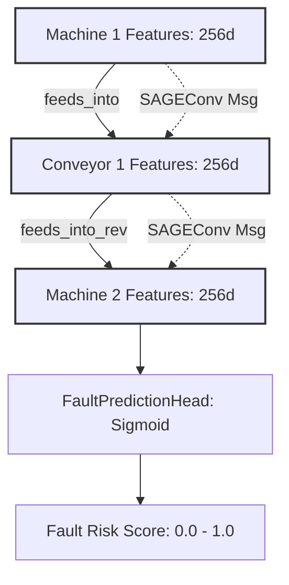
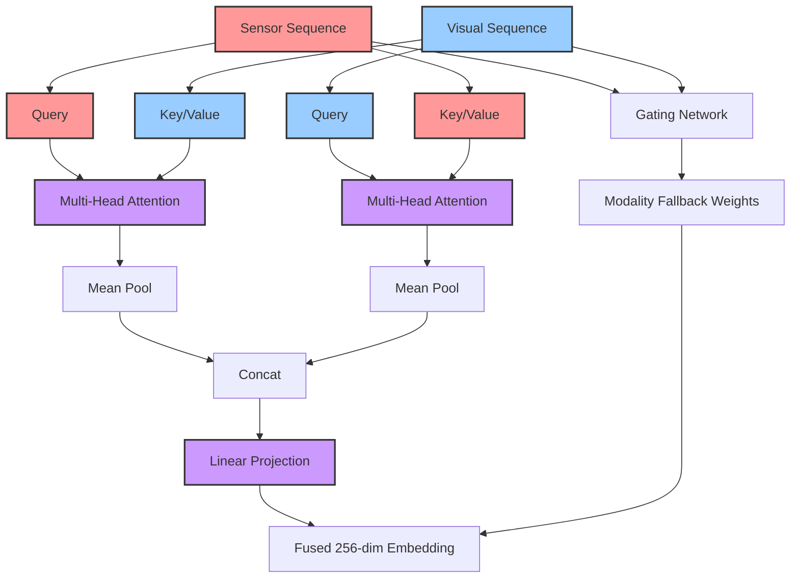

# Models Architecture Documentation

## Sensor Tower

The Sensor Tower is designed to process multivariate time-series sensor data (e.g., CMAPSS sequences) and project them into a shared 256-dimensional embedding space.

### Architecture Overview
1. **1D CNN Feature Extractor**: 3 convolution blocks with `BatchNorm1d`, `ReLU`, and `MaxPool1d`. Outputs a 512-dimensional sequence.
2. **Transformer Encoder**: 2 layers with 4 heads on top of the CNN output, using positional encoding to capture temporal context.
3. **Projection Head**: A 2-layer MLP mapping the Transformer output to a 256-dimensional embedding space with L2 normalization, serving as a shared space for fusion later.

## Heterogeneous GraphSAGE (Equipment Topology GNN)

The HeteroEquipmentGNN is designed to model the physical topology of the factory floor, propagating fault signals and identifying risks across interconnected machines, conveyors, and sensors.

### Architecture Overview
1. **Heterogeneous GNN Wrapper**: Utilizes PyTorch Geometric's `HeteroConv` to handle multiple node types (`machine`, `conveyor`, `sensor`) and edge types independently.
2. **GraphSAGE Layers**: A 2-layer stack of `SAGEConv` (with mean aggregation) per edge relation, allowing for message passing between distinct equipment types.
3. **Fault Prediction Head**: A node-level binary classification head (Linear -> Sigmoid) applied to the target node representations (e.g., `machine`) to output fault probability within the next N cycles.

### Message Passing Diagram

### Fault Propagation & Hop Distance

We simulate faults starting at root machines and traversing downstream via BFS. The `GNNFaultTrainer` uses weighted BCE to handle imbalanced fault classes. As expected, prediction accuracy varies based on hop distance from the root fault.

| Hop Distance | Expected Accuracy | Description |
|---|---|---|
| Hop 0 (Root) | > 95% | Direct fault injection location; clear signal. |
| Hop 1 | ~ 85% | Immediate downstream machine; strong message passing signal. |
| Hop 2 | ~ 70% | Secondary downstream machine; diluted signal. |
| Hop 3+ | < 60% | Distant machines; minimal signal propagation due to 2-layer GNN limit. |

## Cross-Modal Attention Fusion

The `MultimodalFusionModel` wraps the Two-Tower anomaly model, extending it with a bidirectional cross-attention mechanism to fuse the discrete sequence embeddings into a single representation.

### Architecture Overview
1. **Sequence Extraction**: Unlike the baseline anomaly model which pulls `AdaptiveAvgPool` representations, the fusion model intercepts the sequences directly (`(B, L_s, 128)` from Transformer, `(B, L_v, 1792)` from EfficientNet).
2. **Symmetric Cross-Attention**: 
   - **Sensor $\rightarrow$ Visual**: Visual sequences act as Key/Value, while the Sensor acts as the Query.
   - **Visual $\rightarrow$ Sensor**: Sensor sequences act as Key/Value, while the Visual acts as the Query.
   - Outputs are pooled and concatenated.
3. **Learnable Modality Gating**: Handles missing modalities (e.g., when a camera goes offline). The gating network down-weights the missing or low-confidence modality to prevent noisy gradients, allowing the model to gracefully degrade to single-modality inference.

### Attention Flow Diagram

## Anomaly Scoring & Calibration

The final stage of the predictive pipeline maps the fused 256-dim embedding to a robust, actionable `[0, 1]` risk score. 

### 1. Anomaly Scorer Head
We use a 3-layer Multi-Layer Perceptron (MLP) mapping `256 -> 64 -> 16 -> 1`. It outputs a single raw logit, which a Sigmoid activation converts to a bounded probability.

### 2. Mahalanobis Distance (Auxiliary Signal)
For robust Out-of-Distribution (OOD) detection, we compute the Mahalanobis distance from a learned "normal-class" centroid in the embedding space:
- We fit a centroid and an inverse covariance (precision) matrix using a batch of verified normal samples.
- Inference computes the squared distance, acting as a geometric fallback signal if the MLP is uncertain.

### 3. Platt Scaling
Raw neural network probabilities are often overconfident and uncalibrated. We employ **Platt Scaling**:
- A Logistic Regression model is fit on the validation set mapping the raw logits to the true binary labels.
- This ensures the output probability reflects the true empirical likelihood of a fault.

### 4. Threshold Tuning
We do not hardcode a `0.5` decision boundary. Instead, we sweep probabilities to optimize the **F1-score** on the Precision-Recall (PR) curve using the validation set.
- This max-F1 threshold guarantees the best balance between catching faults (Recall) and minimizing false alarms (Precision).

### 5. Confidence Intervals
To quantify certainty, the evaluation pipeline utilizes 1000-sample bootstrapping to report 95% Confidence Intervals (CIs) on headline metrics like AUROC and F1, ensuring the model's reliability in production.
