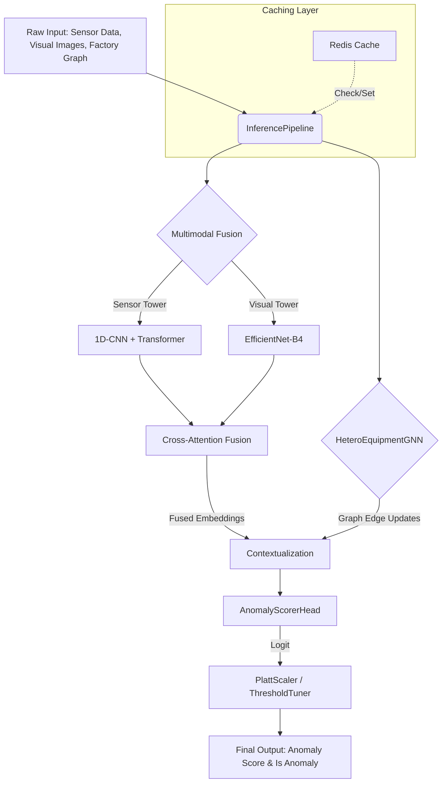

# Inference Pipeline Architecture

The Multimodal Predictive Maintenance Inference Pipeline unifies temporal sensor data, spatial visual inputs, and structural factory topology to provide calibrated anomaly risk scores.

## Overview

## Components

### 1. Multimodal Two-Tower Backbone
- **Sensor Tower**: 1D-CNN combined with a Transformer Encoder to process multi-channel sensor sequences (e.g., vibration, temperature).
- **Visual Tower**: Pre-trained EfficientNet-B4 processing inspection images (e.g., thermal/visible cameras).
- **Cross-Attention Fusion**: Uses an attention mechanism to fuse the modalities, falling back to projection layers dynamically when one modality is missing.

### 2. GNN Contextualization
- **Heterogeneous Graph Neural Network (HeteroEquipmentGNN)**: Updates the individual machine embeddings by aggregating neighborhood features (e.g., from upstream conveyors and local sensors).
- **Message Passing**: Contextualizes the target machine's representation before final fault prediction.

### 3. Anomaly Scoring & Calibration
- **AnomalyScorerHead**: An MLP mapping the high-dimensional context into an uncalibrated probability or logit.
- **Threshold Tuning**: Finds the optimal decision boundary based on F1 score from validation sets.

### 4. Caching & Optimization
- **Redis Integration**: Employs caching based on `machine_id` and a `timestamp` window, mitigating redundant heavy computations for the same time window.
- **Batching Support**: Variable sequence padding ensures smooth batched throughput for `InferencePipeline`.
