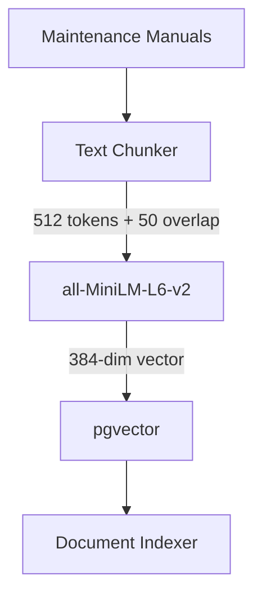

# RAG Pipeline Architecture

This document describes the design of the Retrieval-Augmented Generation (RAG) pipeline for the IndustrialMind project.

## Components

1. **Synthetic Corpus (`backend/app/rag/corpus.py`)**
   - Simulated maintenance manuals and incident reports acting as our knowledge base.

2. **Chunker (`backend/app/rag/chunker.py`)**
   - **Method**: Recursive token-based chunking.
   - **Parameters**: 512 max tokens per chunk, 50 token overlap.
   - **Rationale**: 512 tokens maps well to standard embedding model context windows. The 50 token overlap prevents losing context at chunk boundaries.

3. **Embedding Generator (`backend/app/rag/embeddings.py`)**
   - **Model**: `all-MiniLM-L6-v2` via `sentence-transformers`.
   - **Dimensions**: 384.
   - **Rationale**: Small, extremely fast for CPU inference, and provides high-quality dense embeddings for English semantic search.

4. **Vector Store (`backend/app/db/models.py`)**
   - **Database**: PostgreSQL with `pgvector` extension.
   - **Schema**: `documents` table with `id`, `content`, `metadata_` (JSONB), `content_hash`, and `embedding` (`Vector(384)`).
   - **Idempotency**: Chunks are hashed before insertion to ensure re-runs of the indexer do not duplicate data.

## Workflow Diagram

