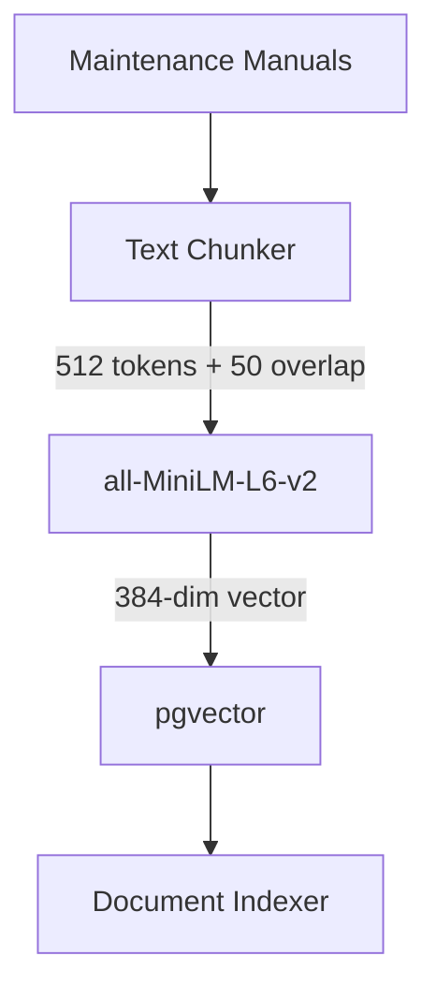

# RAG Pipeline Architecture

This document describes the design of the Retrieval-Augmented Generation (RAG) pipeline for the IndustrialMind project.

## Components

1. **Synthetic Corpus (`backend/app/rag/corpus.py`)**
   - Simulated maintenance manuals and incident reports acting as our knowledge base.

2. **Chunker (`backend/app/rag/chunker.py`)**
   - **Method**: Recursive token-based chunking.
   - **Parameters**: 512 max tokens per chunk, 50 token overlap.
   - **Rationale**: 512 tokens maps well to standard embedding model context windows. The 50 token overlap prevents losing context at chunk boundaries.

3. **Embedding Generator (`backend/app/rag/embeddings.py`)**
   - **Model**: `all-MiniLM-L6-v2` via `sentence-transformers`.
   - **Dimensions**: 384.
   - **Rationale**: Small, extremely fast for CPU inference, and provides high-quality dense embeddings for English semantic search.

4. **Vector Store (`backend/app/db/models.py`)**
   - **Database**: PostgreSQL with `pgvector` extension.
   - **Schema**: `documents` table with `id`, `content`, `metadata_` (JSONB), `content_hash`, and `embedding` (`Vector(384)`).
   - **Idempotency**: Chunks are hashed before insertion to ensure re-runs of the indexer do not duplicate data.

## Workflow Diagram

## Retrieval Architecture

The retrieval engine uses a **Hybrid Search** approach combined with a Cross-Encoder for maximum relevance (Recall@5).

1. **Dense Retriever (`pgvector`)**:
   - Executes nearest-neighbor search using the `<=>` cosine distance operator on 384-dimensional `all-MiniLM-L6-v2` embeddings.

2. **Sparse Retriever (`rank_bm25`)**:
   - Tokenizes documents with technical/industrial term considerations (lowercase, strip punctuation) to match exact keywords (e.g., "bearing", "cavitation").

3. **Hybrid Retriever & Reciprocal Rank Fusion (RRF)**:
   - Fuses Dense and BM25 candidate lists using RRF without needing tuned weights: `score = 1 / (k + rank)` where `k = 60`.
   - Expands queries using domain-specific synonyms (e.g., "bearing failure" -> "bearing wear").

4. **Cross-Encoder Reranker**:
   - The top 20 candidates from the Hybrid Retriever are passed to `ms-marco-MiniLM-L-6-v2`.
   - The Cross-Encoder scores the `(query, document)` pairs simultaneously via attention mechanisms to capture deep semantic relevance, returning the final Top 5.

## Generation Architecture (Gemini 2.5 Flash)

The generation layer utilizes Google's Gemini 2.5 Flash model for reasoning over the retrieved context.

1. **LLM Client (`GeminiClient`)**:
   - Uses `google-genai` SDK.
   - Wraps calls with `tenacity` for exponential backoff on `429 Too Many Requests` or timeouts.

2. **Prompt Template & Strict Citations**:
   - The prompt instructs Gemini to act as an industrial maintenance expert.
   - It strictly forces the model to synthesize answers using *only* the retrieved context and forces `Chunk ID` citations for every factual claim.

3. **Structured Output (`RAGAnswer`)**:
   - Forces Gemini to return JSON that adheres to a strict Pydantic schema:
     `{ "answer": "...", "confidence": 0.95, "sources": ["chunk_1", "chunk_2"], "recommended_action": "..." }`

4. **Hallucination Guard (`HallucinationGuard`)**:
   - A post-hoc validator that intercepts the LLM output.
   - Checks the `sources` cited in the JSON against the actual retrieved candidate `Chunk IDs`.
   - If fake/hallucinated chunks are cited, it strips them and heavily penalizes the confidence score (or rejects the answer completely).
