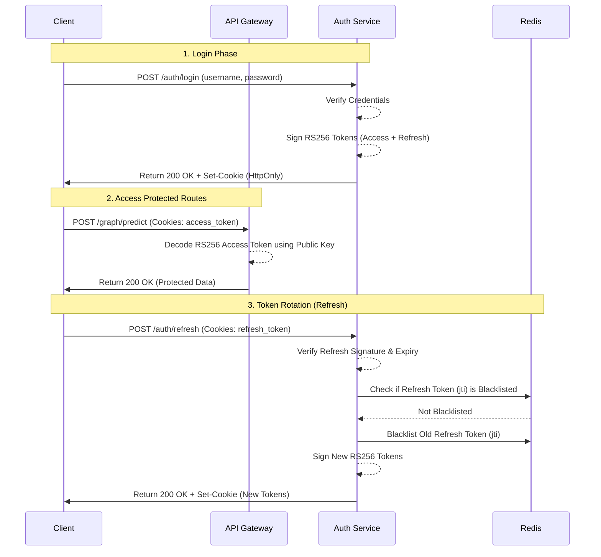

# Security & Authentication Architecture

IndustrialMind utilizes a stateless, asymmetric JWT-based authentication system (RS256) designed for high performance, edge scalability, and robust security.

## Auth Flow Diagram

The following diagram illustrates the authentication lifecycle, from login to token rotation and protected endpoint access.



## Storage Strategy
- **Access Tokens:** Issued with a short lifespan (15 minutes). Stored in the browser as an `HttpOnly`, `SameSite=Lax` cookie to completely mitigate Cross-Site Scripting (XSS) attacks.
- **Refresh Tokens:** Issued with a longer lifespan (7 days). Also stored in `HttpOnly` cookies. Rotated upon every use to detect and prevent token theft.

## RS256 Key Pair Rotation Guide
In a production or edge environment, the RS256 key pair should be rotated periodically (e.g., every 90 days) or immediately if a compromise is suspected.

Because the system is stateless and relies on asymmetric keys, rotating the keys is straightforward:

1. **Generate New Keys:** Run the key generation script on a secure jumpbox.
   ```bash
   python scripts/generate_jwt_keys.py
   ```
2. **Distribute New Keys:** Securely deploy the new `.certs/private_key.pem` to the central Auth Service, and `.certs/public_key.pem` to all edge nodes/API gateways.
3. **Restart Services:** Perform a rolling restart of the backend services. Since edge nodes only need the public key to verify signatures, they can authenticate requests independently without calling the central DB.
4. **Invalidate Old Sessions (Optional):** To forcefully log out all users during an emergency rotation, flush the Redis blacklist and issue the new keys. All existing tokens signed by the old private key will immediately fail validation.
